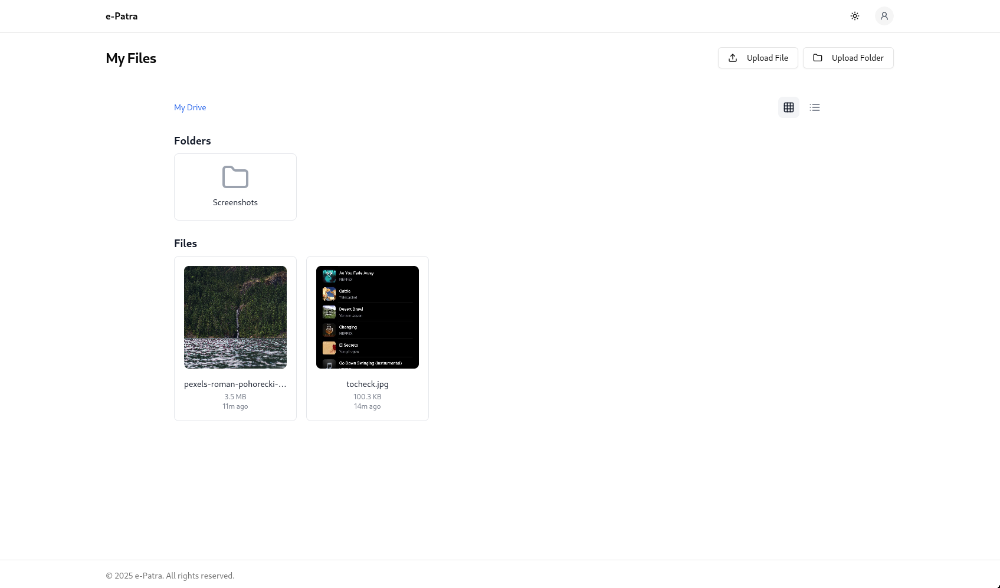
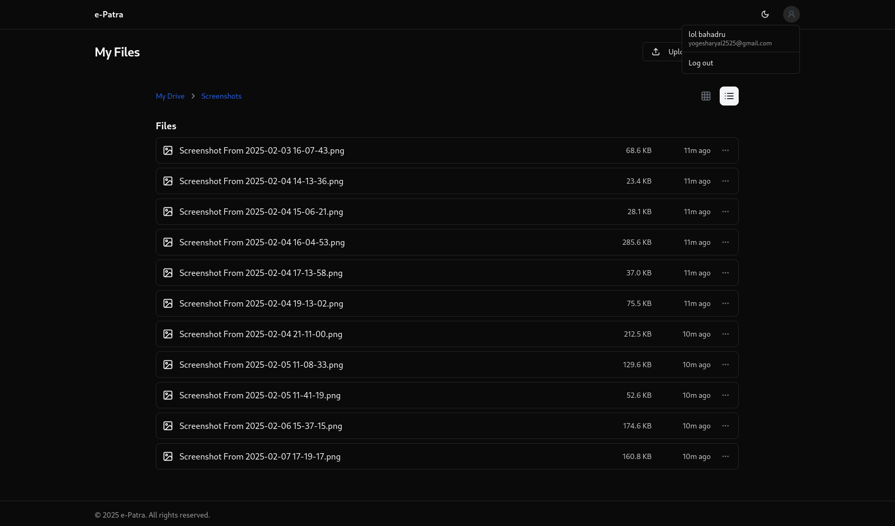

# Role-Based Access Control Drive System

A modern, secure file management system built with role-based access control (RBAC). It provides an intuitive interface for managing files and folders while ensuring proper access control and security.




## Features

- **Role-Based Access Control (RBAC)**
  - Granular permission management
  - Custom role creation
  - User role assignment
  - Permission inheritance

- **File Management**
  - Folder structure support
  - File preview (especially for images)
  - File sharing capabilities
  - Grid and list view options

- **Modern UI/UX**
  - Dark/Light mode support
  - Responsive design
  - Intuitive navigation
  - Real-time updates

## Tech Stack

### Frontend
- React 18 with TypeScript
- Vite for build tooling
- TailwindCSS for styling
- Shadcn UI components
- React Router for navigation

### Backend
- Bun runtime
- Hono for http server
- TypeScript
- Azure Blob Storage for file storage
- Kinde for authentication
- PostgreSQL with DrizzleORM

## Getting Started

1. Clone the repository:
```bash
git clone https://github.com/Aryog/GDrive_Permssion_System.git
cd e-patra
```

2. Install dependencies:
```bash
# Frontend
cd frontend
bun install

# Backend
cd ../
bun install
```

3. Set up environment variables:
```bash
# Frontend (.env)
VITE_BACKEND_URL=http://localhost:3000

# Backend (.env)
DATABASE_URL=your_postgresql_url
AZURE_STORAGE_CONNECTION_STRING=your_azure_connection_string
KINDE_CLIENT_ID=your_kinde_client_id
KINDE_CLIENT_SECRET=your_kinde_client_secret
KINDE_ISSUER_URL=your_kinde_issuer_url
```

4. Run the development servers:
```bash
# Frontend
cd frontend
bun run dev

# Backend
cd ../
bun run dev
```

## Project Structure

```
e-patra/
├── frontend/               # React frontend application
│   ├── src/
│   │   ├── components/    # Reusable UI components
│   │   ├── hooks/        # Custom React hooks
│   │   ├── lib/          # Utilities and helpers
│   │   └── types/        # TypeScript type definitions
│   └── public/           # Static assets
└── backend/              # Bun backend application
    ├── src/
    │   ├── db/          # Database models and migrations
    │   ├── routes/      # API route handlers
    │   └── services/    # Business logic
    └── tests/           # Backend tests
```

## Contributing

1. Fork the repository
2. Create your feature branch (`git checkout -b feature/amazing-feature`)
3. Commit your changes (`git commit -m 'Add some amazing feature'`)
4. Push to the branch (`git push origin feature/amazing-feature`)
5. Open a Pull Request

## License

This project is licensed under the MIT License - see the [LICENSE](LICENSE) file for details.

## Acknowledgments

- [Shadcn UI](https://ui.shadcn.com/) for the beautiful component library
- [Kinde](https://kinde.com/) for authentication services
- [Azure](https://azure.microsoft.com/) for blob storage
